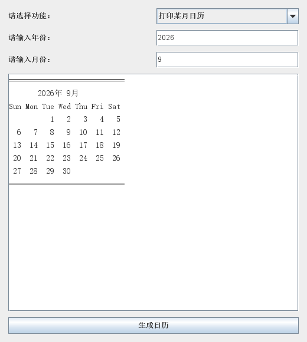

# 简易桌面日历

重庆邮电大学 软件项目开发实训 1 · 指导教师：王高鹏 · 2025.02–2025.03。

基于课程期间的 Java 代码整理，使用 Swing 构建桌面界面，支持全年日历、指定月份日历和当前月日历。日历计算与界面分离，包含中文 Javadoc。



上图由当前程序的 Swing 组件直接渲染。本仓库整理版调整了窗口布局，增加输入范围校验与自动化测试。

## 功能与实现

- 根据能否被 4、100、400 整除判断公历闰年。
- 计算各月份天数，处理二月平年与闰年的差异。
- 使用 `GregorianCalendar` 获取首日星期；月份从输入的 1–12 转换为 Java 的 0–11。
- 使用 `StringBuilder` 按星期偏移生成文本日历，支持十二个月拼接与滚动查看。
- 在 Swing 事件调度线程启动界面；校验非整数、年份与月份边界。

本项目使用统一公历规则，年份支持 1–9999，月份支持 1–12，不用于展示历史历法切换。

## 环境

JDK 8 或更新版本、Maven 3.6 或更新版本。构建目标为 Java 8，以兼容课程原开发环境；Swing 无需额外 GUI 依赖。图形界面运行需要桌面环境。

## 构建与运行

```shell
mvn clean package
java -jar target/java-swing-calendar-1.0.0.jar
```

构建时会执行 JUnit 测试。仅运行测试：

```shell
mvn test
```

没有 Maven 时，也可在 PowerShell 中使用 JDK 直接编译运行：

```powershell
New-Item -ItemType Directory -Force target/classes | Out-Null
javac -encoding UTF-8 -d target/classes src/main/java/com/yangmh/calendar/*.java
java -cp target/classes com.yangmh.calendar.CalendarGUI
```

## 目录与整理说明

```text
src/main/java/com/yangmh/calendar/SimpleCalendar.java  日历计算和文本渲染
src/main/java/com/yangmh/calendar/CalendarGUI.java      Swing 界面和启动入口
src/test/java/com/yangmh/calendar/SimpleCalendarTest.java
docs/calendar-screenshot.png                         当前程序界面渲染图
pom.xml                                              测试和可执行 JAR 构建
```

源材料为课程的“实际代码.docx”。整理时将类拆为独立文件、将包名改为 `com.yangmh.calendar`、把原 `hello` 类入口迁入 `CalendarGUI`，并增加输入范围校验和测试。测试覆盖世纪闰年、月份天数、完整 400 年周期的首日星期、早期与边界年份、文本输出及非法输入。
